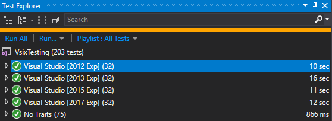

# VsixTesting
[](http://www.nuget.org/packages/VsixTesting.Xunit/)
[](https://gitter.im/josetr/VsixTesting)
[](https://ci.appveyor.com/project/josetr/vsixtesting/branch/master)
[](https://codecov.io/gh/josetr/VsixTesting)

VsixTesting allows you to easily test your Visual Studio Extensions.



## Xunit

.csproj
```xml
<ItemGroup>
    <PackageReference Include="xunit" Version="2.3.1" />
    <PackageReference Include="xunit.runner.visualstudio" Version="2.3.1" />
    <PackageReference Include="VsixTesting.Xunit" Version="0.1.*-beta" />
    <PackageReference Include="VSSDK.Shell.11" Version="11.0.4" />
</ItemGroup>
```

.cs
```csharp
using Microsoft.VisualStudio.Shell;
using Microsoft.VisualStudio.Shell.Interop;
using Xunit;

namespace Tests
{  
    public class TestClass
    {
        [VsFact]
        void FactTest()
            =>  Assert.NotNull(Package.GetGlobalService(typeof(SVsWebBrowsingService)));

        [VsTheory]
        [InlineData(123)]
        void TheoryTest(int n)
        {
            Assert.NotNull(Package.GetGlobalService(typeof(SVsWebBrowsingService)));
            Assert.Equal(123, n);
        }
    }
}

```

### Test Settings 

[ITestSettings.cs](src/VsixTesting/ITestSettings.cs) implemented by
 * [VsTestSettingsAttribute.cs](src/VsixTesting.Xunit/VsTestSettingsAttribute.cs) (for classes/collections/assemblies)
 * [VsFactAttribute.cs](src/VsixTesting.Xunit/VsFactAttribute.cs) (for methods)

## License

This repository is licensed with the Apache, Version 2.0 license.
